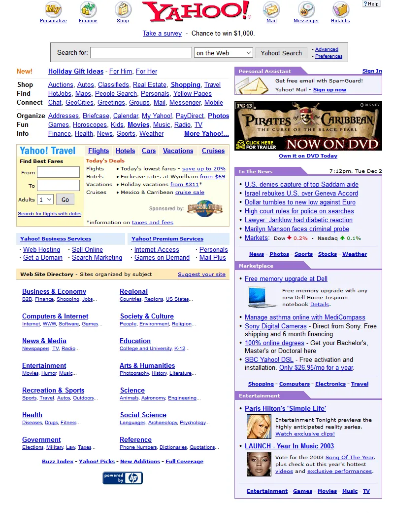
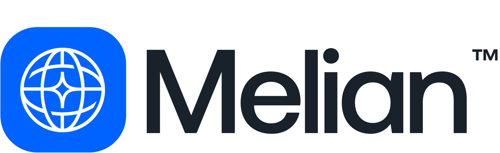
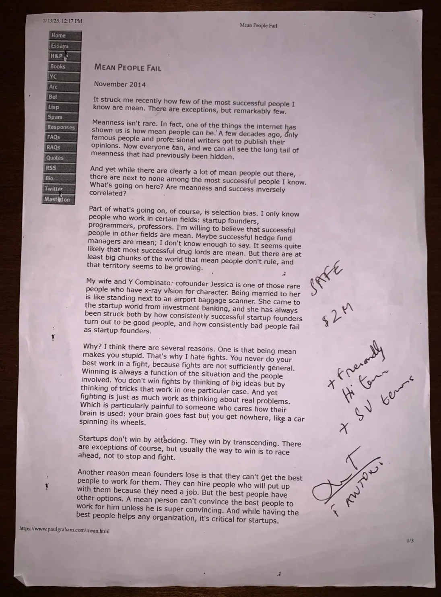

# Melian Seed Announcement

Today, we have some very special news regarding the evolution of our company.

**Sirvana is now Melian**. This new identity aligns with our next big step: launching in the United States and continuing to work towards our mission of organizing the world's products.

Towards that goal, we are thrilled to also announce that we secured **$2.1M in Seed funding**.

Hi Ventures is our [lead investor](https://vercel.com/about#investors), alongside Guillermo Rauch and Damian Schenkelman.

[reel_melian.mp4](files/reel_melian.mp4)

---

# Our origins

In 2023, at 17 years old, we started with a simple goal: to create a platform that brings together all the world's products in one place.

What we observed was that online product search hadn't evolved since the early days of the Web. We, along with our friends, family, and close ones, were constantly experiencing the same frustrations: not knowing where to find a product, not knowing which brand was best, having to open dozens of tabs from different online stores, taking screenshots of brands to check their websites later, endlessly searching to find the right product, lack of personalization, irrelevant results, difficulty discovering new products and brands, difficulty comparing similar products from different stores, trouble finding specific niche or uncommon products, and much more.

A process that should be fun and enjoyable remains full of friction and hasn't evolved in 20 years.

We live in a present that is like the world of Yahoo Directory before Google Search, where you first had to know the exact website you wanted, navigate through static lists of categories and links, and click through endless pages until you found a site that might contain what you needed, and then finally open that website and search again for the specific content, hoping it actually had what you were looking for. Because if it didn't, you'd have to repeat the entire process again and again until you eventually found the right website.

---

That is exactly what is happening with online shopping today.

On our first MVP we focused on solving these problems for a small niche, fashion lovers in Argentina. We gathered 2,000 products (which I uploaded one by one by hand in a JSON file) from 200 brands, so people could search in one place for all the products from those brands:

[https://x.com/SantiagoSirvana/status/1637969794405134337](https://x.com/SantiagoSirvana/status/1637969794405134337)

---

Because we experienced this problem firsthand and people liked it, we continued iterating and launching new versions.

Since that first launch in 2023, we've put all our energy into making product searching and discovery easier and smarter. In that time, the platform has processed over 1 million searches, redirected more than 70,000 clicks to buy, and kicked off the first day of this year as the #3 most downloaded shopping app, on top of giants like Amazon.

For us, it was, and still is obvious that a better online shopping experience is one where you can find all the world's products, brands, and stores in one place. We can't imagine a future where users prefer to visit multiple e-commerce sites and marketplaces every time they want to search for something online, instead of using a single platform with all the products on the web.

# Next Steps and Road Ahead

We are moving to SF in the next couple of months and launching Melian in the United States, where we'll focus all our efforts and energy. The app is available to download right now on the App Store. Try it out and send us your feedback.

If you download the app now, you'll notice that it's quite different from what we previously had.

Instead of showing a feed with pre-scraped stores' products, the Melian App now features an onboarding process where you add your favorite stores by typing their names, pasting URLs, or entering a list of brands. We then fetch all products from these e-commerce sites you've selected into your feed so you can search for everything from the brands you love in one place.

This will be our initial approach since adding all stores from the United States, organizing their products for easy search across millions of brands and items, and creating an onboarding that understands your preferences for the feed and search results would take too long for a first launch in the US. So, following the advice that "startups can only solve one problem well at any given time," we made the initial version much more straightforward: an app that **lets you add any store** by typing their names or pasting URLs of your favorite e-commerce sites, plus a personalized feed displaying products from your added stores with the ability to search across everything in one place.

# **Our New Name: Melian**

Launching in the United States, shutting down the Argentine version, starting again without any users, moving to San Francisco, raising a new round, and Valentin joining Mateo and me as our third co-founder and CTO, made us feel we needed a new name, a new identity. Something we could truly feel was ours, a real part of our story. That's why we decided to choose a new name.

As of today, we are re-establishing our brand identity as Melian.

---

Melian is the most beautiful avenue in Buenos Aires, and it's where our hacker house is located.

Living together at our hacker house on Avenida Melian 2040 was a dream come true.

A group of friends from a small town in Argentina discovered they were experiencing a problem and thought they could solve it. They coded a small version to see if others had the same problem, it went well, the project turned into a startup, raised capital, left the small town, and moved to Buenos Aires to live together, working day and night from the same Hacker House, driven by the dream of building insanely great products. That's our story. And that's why we feel the name Melian genuinely connects with us and the product we want to build.

# Our Seed Funding

To accelerate us in our mission of organizing the world's products, we have raised $2.1M in Seed funding. Our led investor is Hi Ventures. Federico's immediate conviction in our vision was remarkable. From the beginning, we realized that he not only shared our vision but that his expertise would be what we needed even more than the investment itself.

Finding a partner who truly understands what we're building and can help us navigate our growth journey is invaluable for our team.

.jpg>)

---

Federico came to the hacker house for what was supposed to be a one-hour meeting, which extended to four hours and ended with him writing a term sheet right there on a printed Paul Graham essay I had lying around.

---

We are thrilled to welcome them, along with Guillermo Rauch and Damian Schenkelman, as new partners in our mission.

As always, we are very grateful to all our users, friends, investors, partners, and everyone who has always supported us. We know there's still 99% of the work left to do. We're just getting started.
