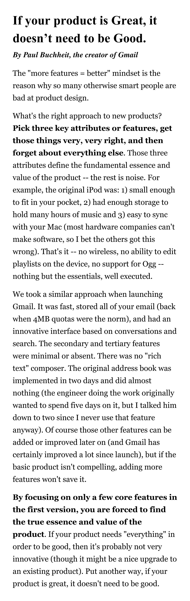
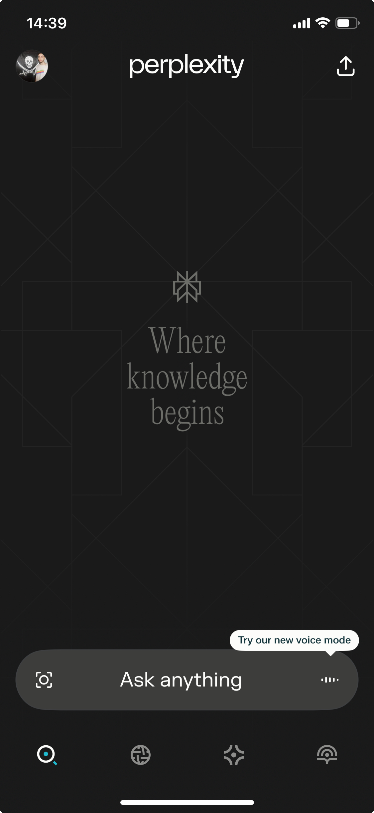
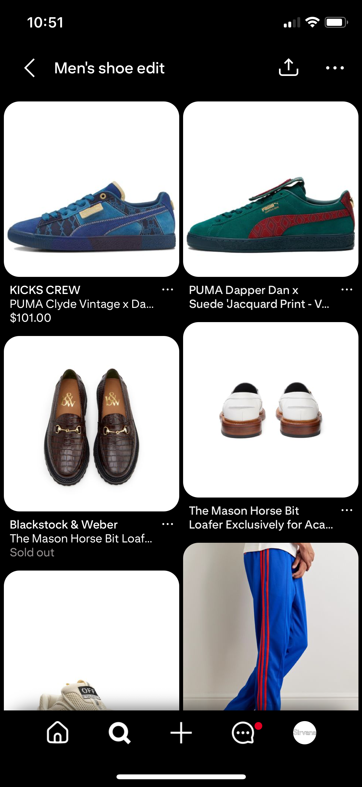
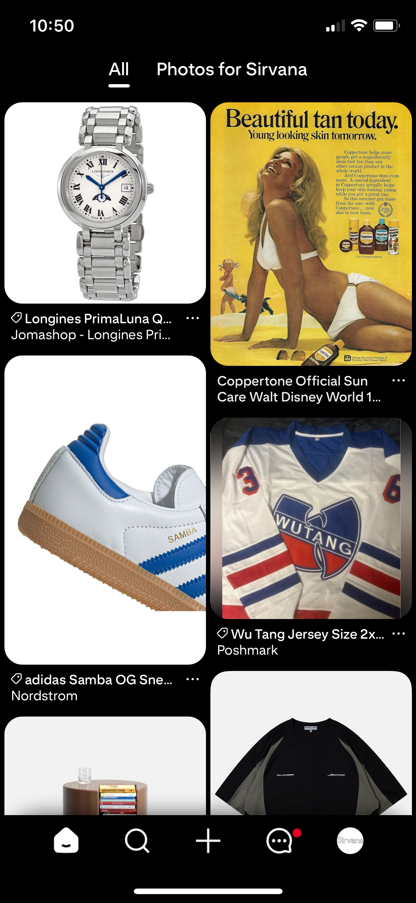
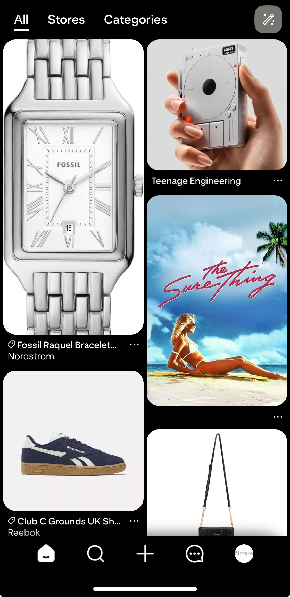
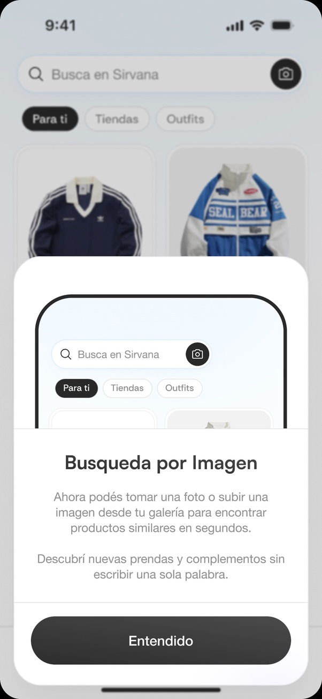

# Melian: First Thoughts Product SF

Creado por: Santiago Ruberto
Fecha de creación: 7 de marzo de 2025 10:36

De nuestro tiempo en Argentina aprendimos muchas cosas sobre cómo desarrollar producto.

Aprendimos que hay que hacer cosas que no escalan, que es clave hablar con los usuarios, que no podemos hacer mil cosas bien y que, de hecho, solo podemos hacer una o dos realmente bien. Y justamente en esas cosas es donde nos tenemos que enfocar.

Ahora nos estamos por ir a San Francisco. Vamos a arrancar de cero, con una nueva oportunidad para lanzar el producto aplicando todo lo que aprendimos hasta ahora.

Esta nueva etapa tiene que venir con un absoluto foco en tener bien puesto el foco. Sí, repetí la palabra "foco" a propósito. Tenemos que ser muy conscientes de dónde ponemos nuestra energía, y asegurarnos de dar una experiencia realmente completa, aunque sea solo para un nicho muy específico con una funcionalidad muy específica. "Startups can only solve one problem well at any given time."

Durante todo lo que va del año siempre dejamos las cosas por la mitad. Llegamos al 80% de todo lo que desarrollamos, pero nunca al 100%.

[Mark Zuckerberg 8020 Everything.mp4](files/Mark_Zuckerberg_8020_Everything.mp4)

**¿Las colecciones?** Hay mil cosas que sabemos que podemos hacer mejor. No podés ver las tiendas que agregaste, nadie sabe siquiera que podés agregar tiendas, ordenar tus colecciones es imposible, ordenar los productos dentro de esas colecciones también es imposible, ordenar las tiendas dentro de esas colecciones tampoco se puede, buscar dentro de tus propias colecciones es imposible, están llenas de bugs, buscar colecciones de otros usuarios es complicado, nadie entiende bien para qué sirve seguir colecciones, compartirlas anda mal, etcétera.

**¿Los outfits?** Hay mil cosas que sabemos que podemos hacer mejor. Es muy difícil etiquetar productos, es complicadísimo buscar los productos que querés etiquetar, la feature está llena de bugs, la pestaña de outfits tarda mil años en cargar, las cards de productos se ven cortadas, solo se puede subir una foto, no podés editar, no podés comentar, no podés puntuar, no podés armar un carrito con los productos etiquetados, no podés ver las fotos de otras personas usando los productos cuando estás decidiendo si comprar algo o no, etcétera.

**¿El poder añadir cualquier tienda?** Sabemos que lo podemos hacer muchísimo mejor. Hoy es imposible encontrar el botón para añadir una tienda dentro de Melian, y si lo encontrás, está bugueado. Cuando alguien manda una URL, llega a Slack y doy el OK, pero después nunca sabemos si esa tienda realmente llegó a Melian o no (recordemos la noche que Lucho se quedó hasta las 5 AM debugueando paa asegurarse de que las tiendas que yo llevaba meses clasificando hubieran llegado bien a Melian prod).

Además, la gente siempre nos manda tiendas por Instagram, pero no tenemos manera de trackear cuántas veces nos mandaron la misma tienda. Tampoco podemos avisarle al usuario cuando la tienda que pidió ya está agregada, ni dejarlo seguir esa tienda o darle más peso en su feed. Tampoco sabemos qué usuario manda qué tienda, ni cuantas tiendas mandó.

No tenemos una forma fácil de añadir tiendas.
No tenemos una forma fácil de asociar la tienda que añadí con mi perfil y mis gustos.
No tenemos una forma fácil de ver qué tiendas siguen mis amigos.
No tenemos una forma fácil para que los usuarios se compartan marcas entre ellos.
No tenemos una forma fácil de ver solo una categoría específica de una marca.
No tenemos una forma fácil de buscar entre los productos de las marcas.

Y así podría seguir eternamente.

Mi punto con esto no es decir: **"uh, lo hicimos mal".** La app está teniendo más uso que nunca. Lo que quiero decir es más bien algo como: che, si nos hubiésemos enfocado 100%—y digo realmente 100%—en hacer que UNA de estas cosas funcione exactamente como queremos que funcione, hoy tendríamos un producto mucho mejor.

[Product Success.mp4](files/Product_Success.mp4)

Al final del ciclo nos dimos cuenta de esto, y decidimos enfocarnos todo el Q en poder añadir automáticamente el 95% de las tiendas en menos de 24 horas. Nos sentamos horas a charlarlo y llegamos a la conclusión de que hacer extremadamente bien eso es lo más importante en este momento.

Tenemos la convicción, la hipótesis, la teoría, de que si podemos sumar cualquier tienda, ecommerce, marketplace o marca dentro de Melian de manera rápida y escalable, vamos a tener un producto que, como mínimo, nosotros mismos usaríamos a full.

Obvio que no sabemos si hacer esto perfecto nos va a dar product-market fit, pero tenemos que probar, con convicción, una de nuestras hipótesis de principio a fin.

Después sí, hablamos con usuarios, aprendemos, iteramos y avanzamos. Pero primero tenemos que estar seguros de que validamos nuestra hipótesis BIEN. Que desarrollamos el producto bien. Que no estaba todo roto, y que pudimos probar lo que queríamos probar realmente al 100%.

Tenemos que SEGUIR enfocados en poder añadir el 100% de las tiendas de manera exitosa en horas o minutos. Necesitamos hacer eso MUY BIEN. Ahora mismo, no importa nada más. Después avanzamos a lo siguiente, pero primero **necesitamos lograr que en Melian puedan estar, rápido y fácil, todos los productos de cualquier tienda que queramos agregar.**

Nuestro primer objetivo para lanzar en San Francisco va a ser ese.

> **Que Melian sea una plataforma a la cual le puedas añadir todos los productos de cualquier tienda que vos quieras, q.**

Enfoquémonos exclusivamente en esto: que cualquier usuario pueda agregar fácil y rápidamente la tienda o marca que quiera, que todos esos productos aparezcan en Melian, y que sea muy simple buscar entre todos los productos de las tiendas agregadas, desde Melian.

**`Un objetivo. Nada más.`**

Cuando lo cumplamos, ahí sí ampliamos a que también puedas encontrar otros productos que no hayas agregado vos. Ahí sí vemos de sumar la búsqueda con imágenes, one-click checkout, reviews de productos, subir outfits, búsqueda con lenguaje natural, perfiles de usuarios, ver lo que compran tus amigos o qué tiendas y marcas siguen, el onboarding, la personalización del feed, upvotes en tiendas, comparaciones de precios, cuadros comparativos de funcionalidades de productos, fuentes de internet.

> "Startups can only solve one problem well at any given time."

> "Startup founder's intuition will always be to do more whereas usually the best strategy is almost always **to do less, really well.** One of the hardest things about doing a startup is choosing what to do, since you will always have an infinite list of things that could be done. It is vital that very early a startup choose the one or two key metrics it will use to measure success, then founders should choose what to do based nearly exclusively on how the task will impact those metrics. When your early stage product isn't working, it's often tempting to immediately build new features in order to solve every problem the user seems to have instead of talking to the users and **focusing only on the most acute problem they have.**"

No podemos enfocarnos en hacer mil millones de features.

Primero tenemos que construir y validar que lo que estamos haciendo es realmente lo que la gente quiere. Después, en base al feedback de los usuarios, iteramos: robustecemos, añadimos, quitamos, cambiamos y mejoramos cosas. Para ganar en San Francisco tenemos que enfocarnos.

What are the three key features we absolutely must get right?

# Entonces, ¿Cómo sería el producto?

El producto va a ser muy simple: **`Una aplicación en la que podés pegar cualquier URL de una e-commerce y automáticamente se agregan esa tienda y todos sus productos. Vas a poder organizarlos y buscar entre todos esos productos y tiendas, y se van a adaptar los resultados y tu feed, en base a tu personalidad e interacciones con Melian.`**

Siguiendo lo que dice el post de arriba, "**Pick three key attributes or features, get those things very, very right, and then forget about everything else**. Those three attributes define the fundamental essence and value of the product -- the rest is noise."

Los tres **key attributes** that we absolutely must get right son:

1. **Vas a poder añadir cualquier e-commerce y todos sus productos.**
2. **Va a ser facil organizar y buscar entre todos los productos y tiendas añadidos.**
3. **Se va a personalizar tu feed y resultados de búsqueda en base a tus interacciones.**

> If the basic product isn't compelling, adding more features won't save it. **By focusing on only a few core features in the first version, you are forced to find the true essence and value of the product.**

Disclaimer: Lo que escribí abajo, lo hice en forma de guía, sobre lo que creo que debería ir en cada pantalla. No hay que seguirlo al pie de la letra, obvio, todo lo que escriba se puede modificar ya sea el orden, las funcionalidades, la manera de hacerlo, etc. Aunque yo ponga primero el que añadas tiendas y despues el onboarding, si creen que es mejor darlo vuelta, procedan. Muchas cosas estan escritas muy literal, porque era la forma en la que trabajamos con Santi Ventura.

# Pantalla 1 - Agregar marcas

Esas marcas, tiendas, ecommerces, marketplaces, etc, los vas a poder agregar:

- Pegando su URL.
- Buscando su nombre y seleccionando la marca.
- Cargando imagenes o videos. Los usuarios pueden cargar screenshots de las tiendas, ya sean de sus cuentas de instagram, sus páginas webs, notas del celular, plantillas de excel, o descargar un video de tiktok que recomienda tiendas y tirarlo ahí.
- Pegando una lista de URls.

**La magia está en que puedas agregar cualquier tienda a Melian de manera MUY FÁCIL.**

La manera de agregar tiendas tiene que ser extremadamente intuitiva. Tiene que tener un autocomplete al buscar las tiendas, porque nadie se acuerda las URLs exactas de las marcas que compra; tiene que mostrarte claramente el ícono o logo de cada tienda; tiene que tener animaciones placenteras y satisfactorias de **success** cuando agregás tiendas de a una, pero también tiene que ofrecerte la posibilidad de agregar muchas tiendas juntas, rápido y sin vueltas, pegando una lista de URLs o cargando screenshots/videos de tiktok.

Vamos a estar haciendo literalmente una sola cosa, así que tiene que estar impecable. Tiene que sentirse mágica. Tiene que tener muchas animaciones y diseño lindo.

Añadir tiendas, buscar entre sus productos y poder organizarlos. Eso es todo lo que vamos a hacer. Por eso mismo, el diseño, el onboarding, las animaciones, absolutamente todo tiene que ser placentero y fluido.

Para la pantalla inicial pre-onboarding, es decir, lo que ves ni bien abris Melian, imagino lo siguiente: en el fondo un texto bien grande y llamativo explicando que es lo que podes hacer, y el texto señala a una barra en el medio donde podes buscar las tiendas que queres agregar + un cuadrado o algo para cargar imagenes o videos y que se agreguen todas esas tiendas.

Algo así como para tirar screenshots

El texto explicativo señalaría la barra del centro de la pantalla, que sería el único call to action de la pestaña inicial. El texto debería ser algo como:

**"Paste URL or search for brands to add them to your account."** O simplemente, **"Paste URL or add brands", "Paste URL or search for brands", "Add brands to your account".**

La barra debería ser redonda y llamativa, al estilo de Perplexity. Desde ahí podés agregar tiendas ya sea **buscándolas directamente dentro de las que Melian ya tiene indexadas** o **pegando la URL**. Nosotros vamos a tener pre-cargados la mayoría de los nombres de las tiendas, por lo que casi siempre podrían encontrar el nombre y seleccionarla. **Tiene que permitirte pegar varias URLs a la vez**, para que puedas añadir múltiples tiendas en un click, de forma rápida y sencilla.

Hay que hacerle la vida fácil al usuario. Cuando busque marcas para agregar, debería aparecer un autocomplete que vaya completando automáticamente la marca a medida que escribe, y que además muestre abajo una lista con todas las marcas que coinciden con lo que está escribiendo.

Al seleccionar tiendas, mostraría cuantas personas han añadido esa tienda. Podemos llamarle followers. X tienda tiene 10 followers. Indicando que 10 personas la añadieron.

Le daría un tilde azul de verificiación a las que tengan más de X followers.

> \*\*\*\*https://mobbin.com/collections/d8bb43f7-6513-4def-98c5-7cb0cb59dd89?utm_source=share_link&utm_medium=share&utm_campaign=collection_sharing

**Habría que inventar el como se vería pegar muchas URLs de una.**

---

Entonces la primera pantalla nos quedaría así: una barra centrada donde podés agregar tiendas, ya sea buscándolas y seleccionándolas, pegando directamente las URLs, o cargando screenshots/videos.

Alrededor iría un texto que explique qué hace Melian, algo tipo:

_"On Melian you can search across all the products from your favorite stores in one place. Just add them."_

👆�� Hay que mejorar el texto. Como inspiración dejo estas "landings":

A medida que se van agregando/seleccionando tiendas, si ya tenemos pre-cargados los productos, estaría bueno mostrar alguna animación con los productos reales de las tiendas que voy agregando, como si se estuvieran añadiendo. Esto lo podríamos hacer con los productos, con los logos de las tiendas, o una combinación.

---

# Pantalla 2 - Onboarding

Después de añadir las tiendas, debería preguntarte si te queres registrar o no, avisandote que si te registras, se te asocian las páginas que agregaste a tu cuenta.

Una vez registrado, necesitamos hacer un onboarding.

Porque, por ejemplo, si yo, Santiago, agrego Nike, no quiere decir que me interese ver ropa de embarazada de Nike en mi feed.

Lo que quiero ver son productos para un hombre de 20 años. Por eso tenemos que hacer un onboarding donde preguntemos el genero, edad, gustos, usersame.

Podríamos hacer que al tocar las categorías de las cosas que te gustan, te recomiende tiendas para agregar.

También queremos hacer cosas divertidas para estar en contacto con los usuarios, como decirles que si ponen su celular y dirección [les enviamos un regalo a sus casas](https://arc.net/l/quote/pnnbnqqt). Eso deberíamos añadirlo en el onboarding, o un pop up que salga cuando alguien scrollea mucho o añade muchos productos a su colección.

---

# Pantalla 3 - Feed

El feed queremos que sea muy parecido al de Pinteret, porque, como ellos, nosotros no vamos a poder controlar el tamaño de las imagenes, por lo que cards "distintas" es lo que mejor nos queda para poder mostrar todos los productos bien.

En cuanto al precio, ya discutimos que queremos que sea muy parecido las cards de cosmos.

---

# Pantalla 4 - Stores

Arriba a la derecha, al lado del feed, queremos tener las tiendas que tenes agregadas.

Sería una pestaña donde podes ver las tiendas que ya tenes agregadas, y donde podes descubrir nuevas tiendas para seguir/agregar.

Desde ahí se debería poder buscar más tiendas para agregar.

Tambien deberiamos tener algo en esta pestaña para descubrir nuevas tiendas.

Ya sea colecciones con tiendas hechas por usuarios, o nosotros hacer carpetas recomendando como las playlists de spotify.

---

# Pantalla 5 - Categories

Arriba a la derecha del todo, al lado del stores, queremos tener las categorias de las tiendas que tengas agregadas.

Sería una pestaña donde podes ver todas las categorías que tienen las tiendas que agregaste.

Desde ahí se debería poder buscar más tiendas para agregar.

Tambien deberiamos tener algo en esta pestaña para descubrir nuevas tiendas.

Ya sea colecciones con tiendas hechas por usuarios, o nosotros hacer carpetas recomendando como las playlists de spotify.

---

### Feedback diseño Ventura:

El nuevo onboarding nos gusto. La animación inicial más el textito están épicas.

El dark mode no nos terminó de convencer. Preferimos en blanco normal más que nada porque la mayoría de productos tienen fondo blanco y el contraste va a ser muy heavy y todo el tiempo.

Las imágenes de fondo, tampoco nos terminaron de convencer. Nos gustaría algo como lo de Shop o directamente más como lo de Perplexity.

Otro punto, de la primera pestaña, haría lo siguiente.

Saquemos el login inicial. Que al meterte te tire la explicación y pase a que añadas las tiendas.
Una vez añadadidas las tiendas, tiraría un pop up, como este que habías hecho:

Que te diga que te loguees para que tus tiendas se guarden y se asocien a tu cuenta así se te asocia a tu perfil. Entonces no obligas a loguearse de una, y lo haces cuando ya "invirtió" tiempo en personalizarse todo.

La animación que metiste de los texto nos encantó, la forma de añadir tiendas nos encantó.

El moviento al "continuar como invitado" también nos gusto mucho.

Agregaría al tipear para buscar una tienda que te vaya saliendo una preview para no tener que escribir la tienda exacta:

Esto está muy bueno y la animación al agregar la tienda también:

Agregaría el que pueda ir seleccionando varias. En la animación que hiciste, después de agregar adidas, me devuelve al inicio. Pero ponele que en el Melian de Argentina, yo quiero agregar HeyBlack, BlackMamba y Blacksecuency, vos ahí me estas obligando a poner tres veces black. Hagamos que a medida que toco "add store" se añada, pero que no me devuelva al inicio inmediatamente, que me deje seguir buscando mostrandome que ya añadi esa tienda.

El "paste a list" excelente. Tendría acá que tener un tachito o que poder deslizar para eliminar (como en spotify) las tiendas que no me gustan, por si Melian se equivoco.

[feedback-disenio.mp4](files/feedback-disenio.mp4)

---
